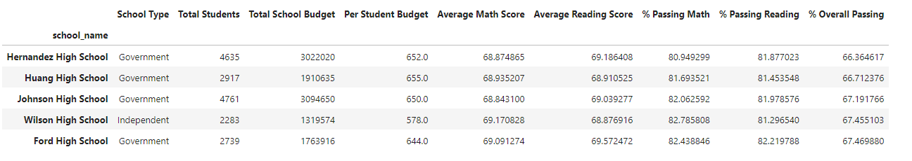
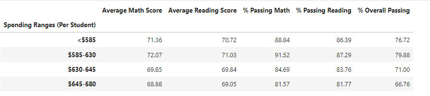
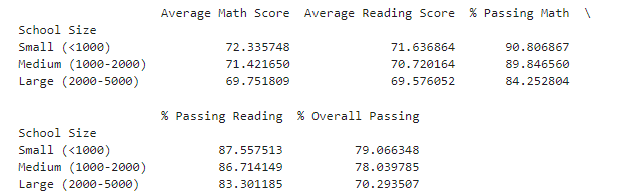

# pandas-challenge

# Written Report

## Executive Summary

> Overall, there are 15 schools with a total enrollment of 39,170 students and a combined budget of $24,649K. The average math score across these schools is 70, with an 86% passing rate. In comparison, the average reading score is 84, with a 73% passing rate.

### Details of the Report
1. **Top Performing Schools**

An analysis of the top-performing schools reveals that the five highest-ranked are Griffin High, Cabrera High, Bailey High, Wright High, and Rodriguez High. These include three independent and two government schools. All have average math scores above 71 and reading scores above 70. Their passing rates for math, reading, and overall exceed 90%, 87%, and 79%, respectively.

2. **Bottom Performing Schools**

In contrast, the bottom five schools - Hernandez High, Huang, Johnson, Wilson, and Ford, four of which are government schools - all have math and reading scores below 70. Their passing rates for math, reading, and overall are below 83%, 83%, and 68%, respectively.

3. **School spending**

Analysis based on school spending shows that, schools spending less than $585 per student have an overall passing rate of 76.72%. In contrast, schools spending more than $685 per student have a lower overall passing rate of 66.76%.

4. **School size**

School size also impacts performance. Schools with fewer than 1,000 students, between 1,000-2,000 students, and 2,000-5,000 students have general passing rates of 79%, 78%, and 70%, respectively.

5. **School Type**

Lastly, an analysis of School Type indicates that government schools have average math and reading scores of 69.8 and 69.7, slightly lower than independent schools, which have average scores of 71.4 and 70.7, respectively. The overall passing rate for government schools is 70.7%, compared to 77.0% for independent schools.

## Conclusion

* Independent schools generally outperform government schools.

* Higher spending per student does not necessarily correlate with better academic performance, as assessed by scores and passing rates.

* Smaller schools tend to exhibit better academic performance, suggesting that students in these environments may receive more focused attention from instructors, leading to higher scores and passing rates.
